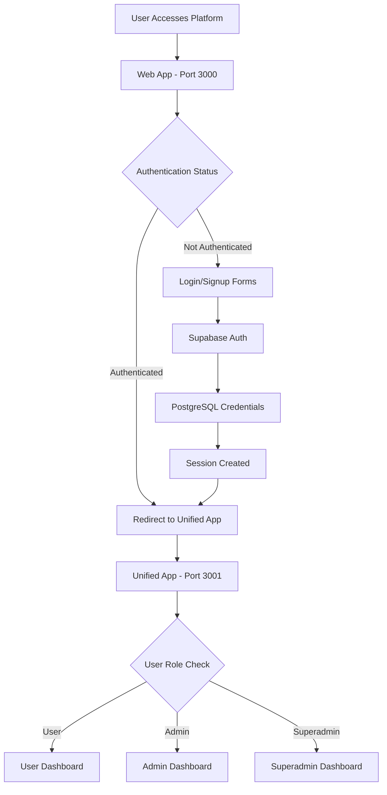

# SMS Hub Monorepo - Current Architecture Status

## 🏗️ Current Architecture (Unified)

### Technology Stack

- **Monorepo Structure**: Turbo + pnpm workspaces
- **Frontend Framework**: React 19 with Vite
- **Styling**: styled-components (CSS-in-JS) - **NO CSS file imports**
- **Backend**: Supabase (PostgreSQL + Auth + Edge Functions)
- **Authentication**: Supabase Auth with real PostgreSQL credentials + SMS OTP
- **State Management**: React Query (TanStack Query)
- **Type Safety**: TypeScript with shared types package

### Simplified App Structure

```
sms-hub-monorepo/
├── apps/
│   ├── web/         # Marketing site & auth gateway (Port 3000)
│   ├── unified/     # Main authenticated dashboard (Port 3001)
│   └── api/         # API documentation
├── packages/
│   ├── ui/          # Shared UI components (styled-components)
│   ├── types/       # TypeScript type definitions
│   ├── config/      # Shared configurations
│   ├── supabase/    # Supabase client & queries
│   ├── utils/       # Utility functions
│   ├── hub-logic/   # Hub configuration & logic
│   └── sms-auth/    # SMS authentication components
└── supabase/
    ├── functions/   # Edge Functions (Deno)
    └── migrations/  # Database migrations
```

## 🔄 App Consolidation Strategy

### Before: 6 Separate Apps
- ❌ `apps/web` - Marketing only
- ❌ `apps/user` - User dashboard
- ❌ `apps/admin` - Admin dashboard  
- ❌ `apps/demo` - Demo environment
- ❌ `apps/docs` - Documentation
- ❌ `apps/texting` - SMS API backend

### After: Production Apps + Legacy/Dev
- ✅ **`apps/web`** (Port 3000) - Marketing site + authentication gateway
- ✅ **`apps/unified`** (Port 3001) - **ALL authenticated functionality**
- 🚧 **`apps/texting`** (Port 3002) - Nest.js backend API (in development)
- ✅ **`apps/api`** - Simple API documentation
- 📛 **`apps/admin`** - Legacy admin (being migrated)
- 📛 **`apps/user`** - Legacy user (being migrated)

## 🔐 Unified Authentication Flow

### Authentication Gateway Pattern



### Authentication Methods

1. **Real Authentication**: Supabase with PostgreSQL storage
2. **Superadmin Access**: superadmin@sms-hub.com / SuperAdmin123!
3. **Development Mode**: Add ?superadmin=dev123 to URL (no persistence)
4. **SMS OTP**: Available for additional verification

### Session Management

- **Cross-App Persistence**: Supabase localStorage maintains sessions
- **Automatic Redirects**: Web app detects authentication status
- **Role-Based Access**: Unified app handles all user types

## 🎯 Unified App Capabilities

### All-in-One Dashboard

The `apps/unified` app now handles:

- **User Functions**:
  - SMS campaign management
  - Contact management
  - Message history
  - Account settings

- **Admin Functions**:
  - Company management  
  - User administration
  - System monitoring
  - Analytics dashboard

- **Superadmin Functions**:
  - Cross-hub access
  - System administration
  - Platform configuration
  - Global analytics

### Role-Based UI

```typescript
// Example role-based rendering
const DashboardContent = () => {
  const { user, role } = useAuth();
  
  return (
    <div>
      {role === 'user' && <UserDashboard />}
      {role === 'admin' && <AdminDashboard />}
      {role === 'superadmin' && <SuperadminDashboard />}
    </div>
  );
};
```

## 🔑 Key Technical Benefits

### 1. Simplified Development
- Single codebase for all authenticated functionality
- Shared components and state management
- Unified build and deployment process

### 2. Better User Experience
- No app switching for different roles
- Consistent UI/UX across all functions
- Faster navigation between features

### 3. Easier Maintenance
- Single authentication system
- Shared dependencies and configurations
- Simplified testing and deployment

### 4. Enhanced Security
- Centralized access control
- Single session management
- Consistent security policies

## 📦 Package Structure

### UI Components (`packages/ui`)
- styled-components based components
- **NO CSS file imports** allowed
- Hub-aware theming via CSS custom properties
- Reusable across all apps

### Types (`packages/types`)
- Database types generated from Supabase
- Shared TypeScript interfaces
- Hub configuration types
- Authentication types

### Supabase Client (`packages/supabase`)
- Factory pattern for Vite environment variables
- React Query hooks for data fetching
- Centralized database operations
- Session management utilities

## 🚀 Development Workflow

### Environment Setup
```bash
# Install dependencies
pnpm install

# Set up environment variables
cp .env.example .env.local
# Add Supabase URL and keys

# Run development servers
pnpm dev  # Starts both web (3000) and unified (3001)
```

### Key Commands
- `pnpm dev` - Start both web and unified apps
- `pnpm dev --filter=@sms-hub/web` - Start only web app
- `pnpm dev --filter=@sms-hub/unified` - Start only unified app
- `pnpm build` - Build all applications
- `pnpm lint` - ESLint across monorepo
- `turbo run build` - Parallel builds with caching

## 🎨 Styling Standards

### CSS-in-JS Only
```typescript
// ✅ Correct - using styled-components
import styled from 'styled-components';

const Button = styled.button`
  background: var(--hub-primary);
  color: white;
  padding: 12px 24px;
`;

// ❌ Incorrect - NO CSS imports
import './Button.css';  // NOT ALLOWED
```

### Hub-Aware Theming
```typescript
// CSS custom properties for hub branding
const ThemedComponent = styled.div`
  background: var(--hub-primary);
  border: 1px solid var(--hub-secondary);
`;
```

## 🔧 Environment Configuration

### Vite Environment Variables
```bash
# Web App & Unified App (.env.local)
VITE_SUPABASE_URL=https://vgpovgpwqkjnpnrjelyg.supabase.co
VITE_SUPABASE_ANON_KEY=[anon-key]

# Development flags
VITE_DEVELOPMENT_MODE=true
```

### Supabase Edge Functions
```bash
# Edge Functions (Deno environment)
SUPABASE_URL=https://vgpovgpwqkjnpnrjelyg.supabase.co
SUPABASE_SERVICE_ROLE_KEY=[service-role-key]
```

## 📊 Multi-Tenancy (Hub System)

### Hub Configuration
- **PercyTech**: Hub ID 1
- **Gnymble**: Hub ID 2  
- **PercyMD**: Hub ID 3
- **PercyText**: Hub ID 4

### Database Operations
```typescript
// Always include hub_id in queries
const { data } = await supabase
  .from("campaigns")
  .select("*")
  .eq("hub_id", hubConfig.id)
  .eq("company_id", companyId);
```

## 🏁 Production Readiness

### Deployment Architecture
- **Web App**: Marketing + auth gateway
- **Unified App**: Complete authenticated platform
- **Database**: Supabase PostgreSQL with real credentials
- **Session Management**: Cross-app Supabase localStorage
- **Edge Functions**: Deployed and operational

### Performance Optimizations
- Turbo build caching
- Code splitting in Vite
- React Query data caching
- Styled-components runtime optimization

## 🎯 Future Considerations

### Potential Enhancements
1. **Micro-frontend Architecture**: If scaling requires app separation
2. **Server-Side Rendering**: For improved SEO on marketing pages
3. **Mobile Apps**: React Native with shared packages
4. **Advanced Analytics**: Dedicated analytics dashboard

### Current Limitations
- Single Point of Failure: All authenticated functionality in one app
- Bundle Size: Larger unified app vs. smaller specialized apps
- Development Complexity: All team members work in same codebase

## ✅ Architecture Status Summary

- ✅ **App Consolidation**: Complete (6 apps → 3 apps)
- ✅ **Authentication Flow**: Gateway pattern implemented
- ✅ **Role-Based Access**: Working in unified app
- ✅ **Session Management**: Cross-app persistence working
- ✅ **Styling Migration**: All CSS-in-JS, no file imports
- ✅ **Package Architecture**: Clean separation of concerns
- ✅ **Build System**: Turbo + pnpm optimized
- ✅ **Database**: PostgreSQL with real authentication
- ✅ **Edge Functions**: Deployed and operational

**Status**: ✅ **PRODUCTION READY** - Unified architecture is stable and deployed.

The SMS Hub platform has successfully consolidated into a clean, maintainable architecture with clear separation between marketing/auth (web) and functionality (unified), while maintaining all the benefits of the monorepo structure.