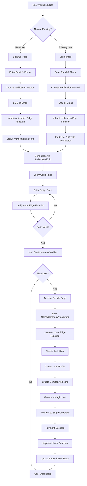

# SMS Hub Monorepo - Architecture & Project Status Summary

## 🏗️ Architecture Overview

### Technology Stack

- **Monorepo Structure**: Turbo + pnpm workspaces
- **Frontend Framework**: React 19 with Vite (migrated from Next.js)
- **Styling**: Styled-components (CSS-in-JS) - no CSS file imports
- **Backend**: Supabase (PostgreSQL + Auth + Edge Functions)
- **API Layer**: Supabase Edge Functions
- **Type Safety**: TypeScript with shared types package
- **State Management**: React Query (TanStack Query)
- **Payment Processing**: Stripe Checkout + Webhooks

### Project Structure

```
sms-hub-monorepo/
├── apps/
│   ├── web/         # Marketing site (Vite) - Port 3000
│   ├── user/        # User dashboard & auth (Vite) - Port 3001
│   ├── admin/       # Admin dashboard (Vite) - Port 3002
│   ├── demo/        # Demo application
│   └── docs/        # Documentation site
├── packages/
│   ├── ui/          # Shared UI components (styled-components)
│   ├── types/       # TypeScript type definitions
│   ├── config/      # Shared configurations
│   ├── supabase/    # Supabase client & queries
│   ├── utils/       # Utility functions
│   ├── hub-logic/   # Hub configuration & logic
│   └── sms-auth/    # SMS authentication components
└── supabase/
    ├── functions/   # Edge Functions (Deno)
    └── migrations/  # Database migrations
```

## 🔄 Current Project Status

### ✅ Completed Tasks

1. **Database Schema Refactoring**
   - Renamed `temp_signups` → `verifications` table
   - Updated all references across codebase
   - Maintained proper foreign key relationships

2. **TypeScript & Build Issues**
   - Fixed all critical TypeScript errors in User app
   - Added React dependencies to supabase package
   - Resolved parameter type annotations
   - User app now builds successfully

3. **Edge Functions Updates**
   - Updated all Edge Functions to use `verification_id`
   - Deployed updated functions to production
   - Fixed parameter mismatches between frontend and backend

### 🚧 In Progress

- Testing complete onboarding flow
- Stripe Checkout integration verification

### 📋 Pending Tasks

- Regenerate database types after schema migration
- Full end-to-end testing of signup → payment flow

## 🔐 Authentication & Onboarding Flow

### Complete User Onboarding Journey



### Detailed Flow Explanation

#### 1. **Initial Contact** (`/signup` or `/login`)

- User provides email and phone number
- Selects verification method (SMS preferred, email fallback)
- Frontend stores data in sessionStorage for flow continuity

#### 2. **Verification Creation** (`submit-verification` Edge Function)

- Creates record in `verifications` table with:
  - Unique verification code (6 digits)
  - 10-minute expiration
  - User contact details
  - Hub ID for multi-tenancy
- Sends code via Twilio (SMS) or SendGrid (email)
- Returns `verification_id` to frontend

#### 3. **Code Verification** (`/verify?id={verification_id}`)

- User enters 6-digit code
- `verify-code` Edge Function validates:
  - Code matches
  - Not expired
  - Not already verified
- Updates `is_verified = true` on success

#### 4. **Account Creation** (`/account-details?id={verification_id}`)

- **New Users Only**: Collect additional info
  - First/Last name
  - Company name (B2B)
  - Password
- `create-account` Edge Function:
  - Creates Supabase Auth user
  - Generates account numbers
  - Creates user_profile record
  - Creates company record (B2B)
  - Establishes membership relationship
  - Generates magic link for auto-login

#### 5. **Payment** (Stripe Checkout)

- `create-checkout-session` Edge Function
- Redirects to Stripe hosted checkout
- Single onboarding package offering
- Success URL: `/payment-callback`
- Cancel URL: back to signup

#### 6. **Post-Payment** (`stripe-webhook` Edge Function)

- Receives Stripe webhook events
- Updates customer records with Stripe IDs
- Activates subscription status
- Completes onboarding flow

## 🎯 Strategic Decisions Made

### 1. **Verification-Based Auth**

- Replaced traditional email/password with SMS/email verification
- More secure and user-friendly for B2B
- Supports both new signups and existing user login

### 2. **Database Architecture**

- Single `verifications` table for all verification flows
- Separate concerns: verification → account creation → payment
- Clean audit trail and security

### 3. **Payment Strategy**

- Stripe Checkout (hosted) vs custom payment page
- Decision: **Use Stripe Checkout** for:
  - PCI compliance
  - Trust & recognition
  - Faster implementation
  - Automatic updates & features

### 4. **Multi-Tenancy Design**

- 4 hubs with unique branding and features
- Hub ID required in all database operations
- Shared codebase with hub-specific configurations

### 5. **Edge Functions Architecture**

- Discrete functions for each operation
- Stateless and scalable
- Clear separation of concerns

## 🔑 Key Technical Patterns

### Environment Variables

```typescript
// Vite apps use import.meta.env
import.meta.env.VITE_SUPABASE_URL;

// Edge Functions use Deno.env
Deno.env.get("SUPABASE_URL");
```

### Database Operations

```typescript
// Always include hub_id
const { data } = await supabase
  .from("verifications")
  .select("*")
  .eq("hub_id", hubConfig.hubNumber)
  .eq("id", verificationId);
```

### Type Safety

```typescript
// Import from shared types
import { Company, UserProfile, Verification } from "@sms-hub/types";

// Use proper type annotations
const campaigns: Campaign[] = data || [];
```

## 🚀 Next Steps

1. **Complete Testing**
   - Full signup flow with real phone numbers
   - Stripe payment integration
   - Webhook processing

2. **UI/UX Polish**
   - Loading states
   - Error messaging
   - Success feedback

3. **Production Readiness**
   - Environment variables verification
   - Error logging
   - Monitoring setup

4. **Feature Development**
   - Dashboard functionality
   - SMS campaign creation
   - Contact management

The architecture is solid, secure, and scalable. The verification-based auth flow is implemented and working. Stripe Checkout integration is ready. The main focus now is testing and polish before launch.
