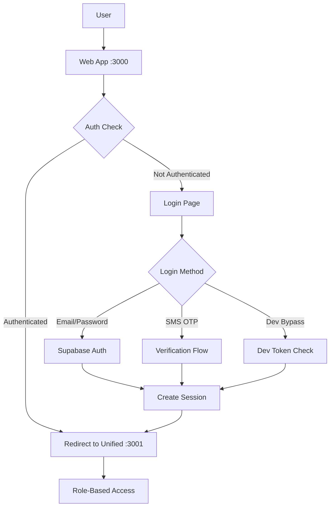

# SMS Hub Authentication Architecture

## Overview

SMS Hub uses a dual-mode authentication system that supports both production Supabase authentication and development bypass for testing. This document outlines the security architecture and best practices.

## Authentication Flow



## Security Architecture

### Frontend Security (Web & Unified Apps)

1. **Anon Key Only**
   - Frontend apps ONLY use `VITE_SUPABASE_ANON_KEY`
   - This key has limited permissions suitable for client-side use
   - Never expose service role key in frontend code

2. **Authentication Methods**
   - **Production**: Supabase Auth with email/password or SMS OTP
   - **Development**: Secure token bypass (stored in localStorage)

3. **Current Implementation**
   ```typescript
   // Frontend: Using anon key (SECURE)
   const supabase = createSupabaseClient(
     import.meta.env.VITE_SUPABASE_URL,
     import.meta.env.VITE_SUPABASE_ANON_KEY
   );
   ```

### Backend Security (Edge Functions & API)

1. **Service Role Key**
   - Only available in Edge Functions and backend API
   - Used for admin operations (user management, bypassing RLS)
   - Never sent to or stored in frontend

2. **Admin Operations**
   - List all users
   - Create/update/delete users
   - Modify user roles
   - Access all data regardless of RLS

## Authentication Methods

### 1. Production Authentication (Supabase)

**Email/Password Login**
- Default method for returning users
- Uses Supabase's secure password hashing
- Session persisted in localStorage

**SMS OTP Verification**
- For new signups or additional security
- Sends code via Edge Function
- Verifies phone ownership

### 2. Development Authentication

**Quick Dev Bypass**
```
http://localhost:3001/?superadmin=dev123
```
- For rapid development testing
- Bypasses Supabase entirely
- Not available in production

**Secure Token Bypass**
- Uses environment-based token
- Persisted in localStorage
- More secure than hardcoded values

## Current Credentials

### Superadmin Account
- **Email**: superadmin@gnymble.com
- **Password**: SuperAdmin123!
- **Hub**: Gnymble (ID: 1)
- **Role**: SUPERADMIN

## RLS (Row Level Security) Status

**Current State**: RLS is DISABLED on all tables

**Implications**:
- Anon key can perform CRUD operations on all tables
- No automatic hub_id filtering
- Manual hub_id inclusion required in queries

**Future State**: When RLS is enabled
- Policies will enforce hub isolation
- User can only access their company's data
- Admin operations will require service role key

## Best Practices

### DO ✅
- Use `getSupabaseClient()` for all frontend operations
- Include hub_id in all database queries
- Use Edge Functions for admin operations
- Store only anon key in frontend environment

### DON'T ❌
- Never expose service role key in frontend
- Don't use admin operations from frontend
- Avoid storing sensitive data in localStorage
- Don't bypass hub_id in queries

## Migration Path

### Current Issues to Fix
1. ❌ Admin Users page using admin client in frontend
2. ❌ Service role key reference in unified app
3. ❌ Missing RLS policies on tables

### Solution Architecture
```
Frontend (Anon Key) → Edge Function (Service Role) → Database
```

### Implementation Steps
1. Create Edge Functions for admin operations
2. Update frontend to call Edge Functions
3. Remove all service role references from frontend
4. Enable RLS policies progressively

## Edge Functions for Admin Operations

### Planned Functions

1. **admin-users**
   - List all users (with pagination)
   - Create new users
   - Update user roles
   - Delete users

2. **admin-companies**
   - Manage companies across hubs
   - Update company settings
   - View company analytics

3. **admin-analytics**
   - Cross-hub analytics
   - System health metrics
   - Usage statistics

## Testing Authentication

### Local Development
```bash
# Test with dev bypass
open http://localhost:3001/?superadmin=dev123

# Test real authentication
open http://localhost:3000/login
# Use: superadmin@gnymble.com / SuperAdmin123!
```

### Verify Authentication
```javascript
// Check auth state in console
const { data: { user } } = await supabase.auth.getUser();
console.log('Current user:', user);
```

## Security Checklist

- [ ] Remove getSupabaseAdminClient from frontend
- [ ] Update admin pages to use Edge Functions
- [ ] Verify no service role keys in .env.local
- [ ] Implement proper error handling for auth failures
- [ ] Add rate limiting to auth endpoints
- [ ] Enable RLS policies on sensitive tables
- [ ] Regular security audits of auth flow

## Related Documentation

- [PROJECT_SUMMARY.md](./PROJECT_SUMMARY.md) - Overall project structure
- [ARCHITECTURE_STATUS.md](./ARCHITECTURE_STATUS.md) - Current architecture state
- [Edge Functions Guide](../supabase/functions/README.md) - Edge Functions documentation